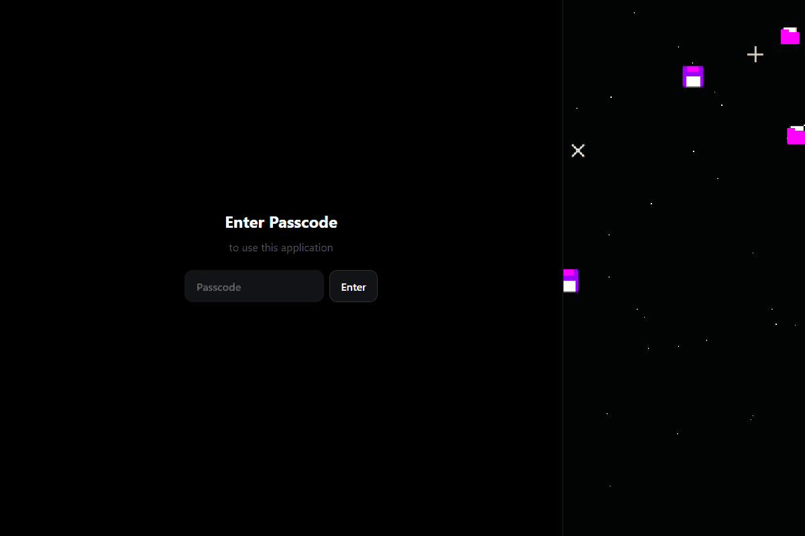
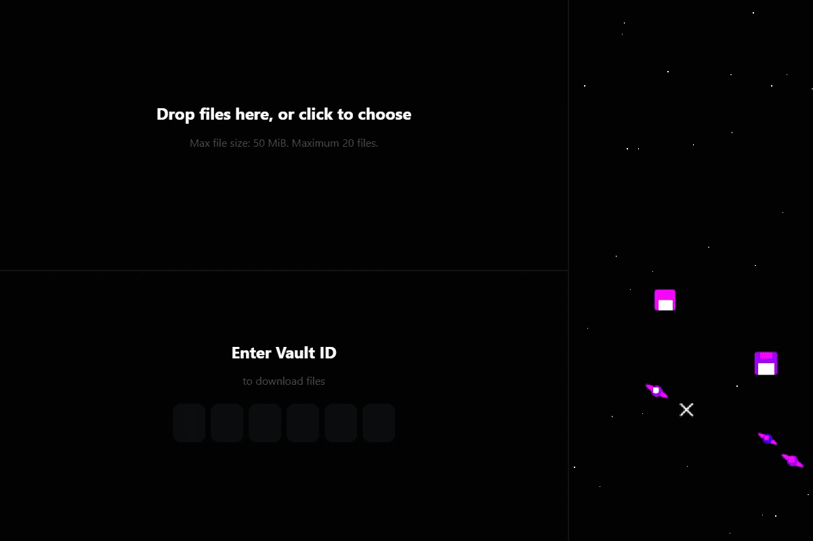
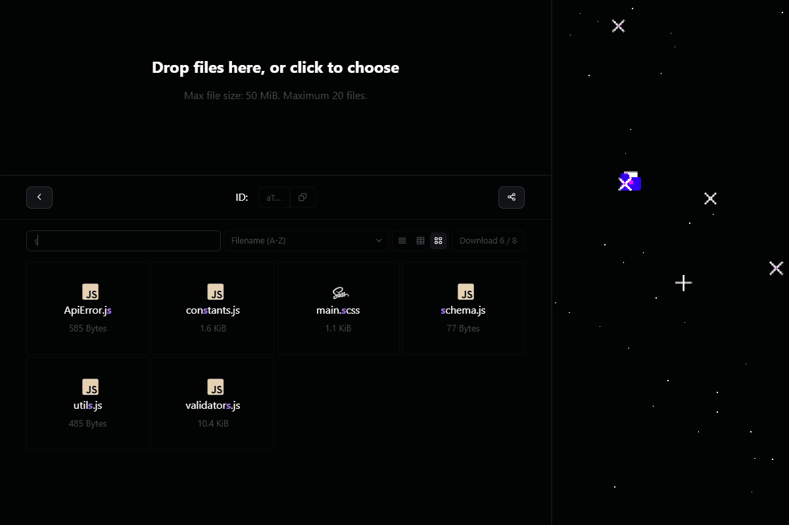
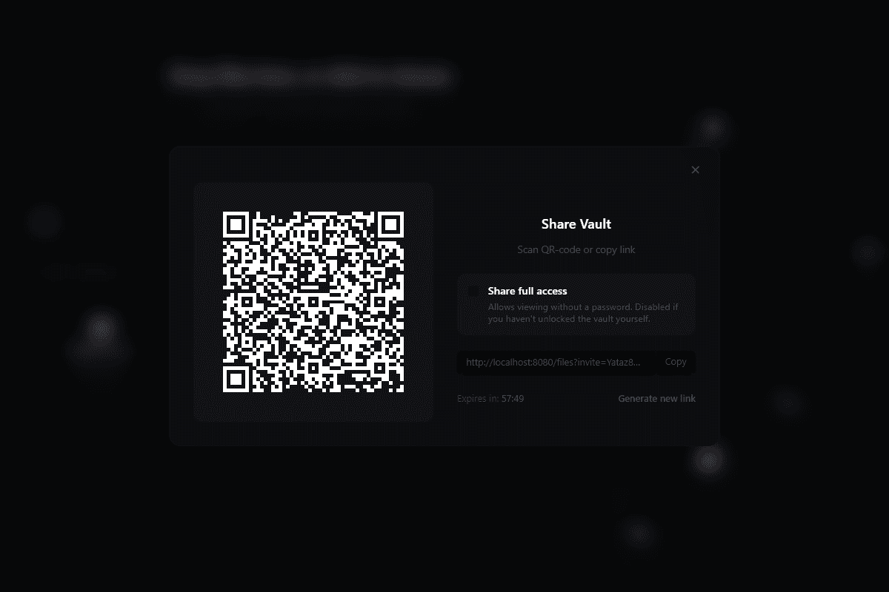

# blob-shuttle 

> **🚀 Personal file transfer tool.**  
> A lightweight PWA that turns any browser into a temporary file hub - no accounts, no cloud storage subscriptions, no USB cables. Drop files, share a 6-character vault ID or an invite link, and let others download (or upload) instantly. Just open, drop, and go.

Designed to be adaptable: the storage layer and runtime infrastructure are fully customizable - write your own driver for S3, local disk, or anything else, and plug it into any serverless platform. Examples included to get you started.

### Screenshots

<table align="center">
  <tr>
    <td width="50%" align="center">
       
      <b>0. Login</b>
    </td>
    <td width="50%" align="center">
       
      <b>1. Upload / Enter Vault ID</b>
    </td>
  </tr>
  <tr>
    <td width="50%" align="center">
       
      <b>2. Check files</b>
    </td>
    <td width="50%" align="center">
       
      <b>3. Share vault</b>
    </td>
  </tr>
</table>

---

## why

because

---

## stack

- front: pug + scss + ts, [file-icons-js](https://github.com/exuanbo/file-icons-js)
- back: ts + Node.js >= 22
- storage: customizable (aws s3 as an example)
- runtime: customizable (infrastructure/yandex-cloud/ as an example)

---

## how it works

1. open site -> enter passcode (unless you came via authorized invite link)
2. create vault -> drop files -> upload -> voila!
3. view vault -> enter 6-char Vault ID -> download any file you want from revealed list.
4. share vault -> share Vault ID code OR press "Share" to copy link (1h lifetime)

> [!CAUTION]
> anyone with link or Vault ID can view *and* upload to same vault

---

## under the hood

- **auth** = two passcode variants from env:
  - `PASSCODE` - regular passcode, not cached on client;
  - `LONG_TERM_PASSCODE` - optional, sends `cache_allowed: true` for auto-login localStorage cache.

- no automatic cleanup is implemented. You may configure S3 Lifecycle or a separate scheduler.

- auth lives in request body (`auth.passcode` / `auth.invite`) and localStorage (if entered with LONG_TERM_PASSCODE).
  This is done taking into account that some environments may strip authorization headers, cookies, etc.

- no rate limiting and other security stuff. Recommended using proxy or API Gateway
  brute-forcing vault_id? `62^6` combos. And still, project is for personal use.

- `HOST_SPA` flag in `src/shared/constants.ts`. If set to `false`, backend becomes JSON API only - you'll need to host frontend separately. This is not the primary use case.

---

## how to install

1. write infrastructure-specific function adapter (`/src/infrastructure/your-infrastructure/someentryfile`) on GET and POST endpoints.
   The adapter is responsible for translating incoming cloud requests to the internal Request type and converting the internal Response type to the cloud response format. See `src/infrastructure/drivers/storage/index.example.ts` for a local filesystem example utilizing Express + node:fs.
2. write your own /src/infrastructure/drivers/storage/index.ts from scratch or use finished s3 driver
3. adjust constants in `src/shared/constants.ts`
4. setup env file (don't forget to remove .example)
5. install dependencies: `npm i`
6. build in the correct order:
   1. `npm run build:frontend` compiles bundle, cleans /dist, copies package.json and static.
   2. `npm run build:backend` compiles typescript.

   or use `npm run build` (if works)

## how to run example

1. create a bucket in yandex object storage
2. create a service account with `storage.uploader`, `storage.viewer`, and `storage.editor` roles.
3. generate a static access key for it.
4. use example drivers, infrastructure wrapper
5. adjust constants in `src/shared/constants.ts`
6. setup env file (don't forget to remove .example)
7. run `npm i`
   - terminal 1: `npm run serve` (frontend)
   - terminal 2: `npm run server` (backend)
        This runs `server.example.ts` - a local Express server that emulates Yandex Cloud Functions.
        It serves the API at `/files` and mounts the storage router from `index.example.ts`.